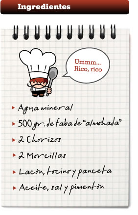
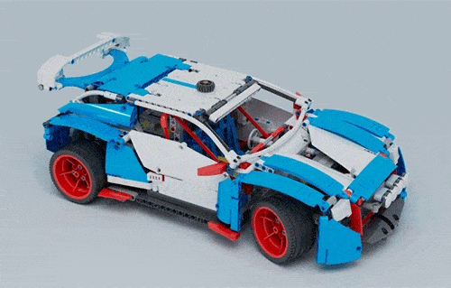
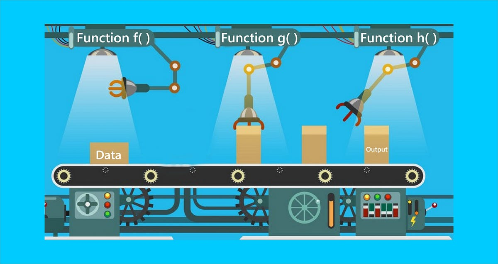
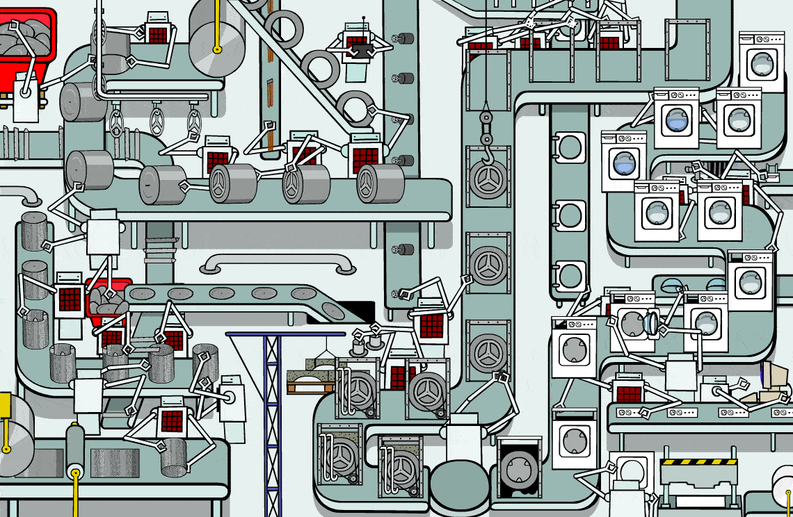
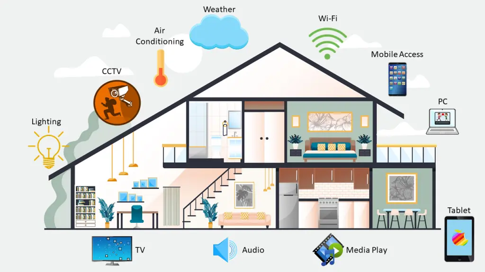

# Exploring Paradigms in Python

## I. Definition of Programming Paradigms:

A programming paradigm is a fundamental style or approach to programming that dictates the structure, organization, and execution of code. It defines how we write, structure, and execute programs, providing a conceptual framework for understanding and solving problems. Different programming languages often support multiple paradigms, allowing developers to choose the most appropriate one for a particular task.

## II. Major Programming Paradigms:

1. **Imperative Programming:**
   - This paradigm focuses on describing how a program operates, emphasizing the sequence of statements that modify the program's state.
   - Python supports imperative programming through constructs like loops, conditionals, and assignments.

2. **Object-Oriented Programming (OOP):**
   - In OOP, programs are organized as collections of objects, each having attributes and behaviors.
   - Python is a powerful OOP language, supporting encapsulation, inheritance, and polymorphism, making it easy to design and implement complex systems.

3. **Functional Programming:**
   - Functional programming treats computation as the evaluation of mathematical functions and avoids changing state and mutable data.
   - Python incorporates functional programming features, such as higher-order functions, lambda expressions, and support for first-class functions.

4. **Procedural Programming:**
   - This paradigm organizes code into procedures or routines, with an emphasis on modular design and code reusability.
   - While Python is known for its OOP support, it also accommodates procedural programming, allowing developers to use functions and procedures for structured code.

5. **Event-Driven Programming:**
   - In event-driven programming, the flow of the program is determined by events such as user actions or messages from other programs.
   - Python can be used for event-driven programming, especially in GUI (Graphical User Interface) applications, where events trigger responses.

## III. Python's Flexibility and Multi-Paradigm Nature:

1. **Syntax Readability:**
   - Python is renowned for its clean and readable syntax, which facilitates code comprehension and maintenance, regardless of the paradigm used.

2. **Dynamic Typing:**
   - Python's dynamic typing allows developers to switch between paradigms seamlessly, adapting their code to different approaches without the need for extensive type declarations.

3. **Libraries and Frameworks:**
   - Python's extensive standard library and third-party frameworks cater to various paradigms, empowering developers to choose the tools that best suit their programming style and goals.

## IV. Examples of Paradigm Integration in Python:

### 1. Imperative Programming:

**Metaphor:** **Cooking Recipe**

**Explanation:**
Imperative programming is like following a cooking recipe step by step. You have a set of instructions, and you perform them in a sequence to achieve the desired result. In our example, it's akin to going through the steps of a recipe, one by one, to cook a delicious dish.

```python
ingredients = [1, 2, 3, 4, 5]
total = 0

for ingredient in ingredients:
    if ingredient % 2 == 0:
        square = ingredient ** 2
        total += square

print("Sum of squares of even numbers:", total)
```




### 2. Object-Oriented Programming (OOP):

**Metaphor:** **Building with Lego Bricks**

**Explanation:**
Object-Oriented Programming is like building with Lego bricks. Each Lego piece (object) has its own characteristics (attributes) and can perform certain actions (methods). In our example, creating a `Dog` class is like defining a specific type of Lego brick, and creating an instance of that class is like building something unique with those bricks.

```python
class Dog:
    def __init__(self, name, age):
        self.name = name
        self.age = age

    def bark(self):
        print("Woof!")

# Creating an instance of the Dog class
my_dog = Dog("Buddy", 3)

# Accessing attributes and invoking a method
print(f"{my_dog.name} is {my_dog.age} years old.")
my_dog.bark()
```




### 3. Functional Programming:

**Metaphor:** **Conveyor Belt Factory**

**Explanation:**
Functional programming is like a conveyor belt factory. Each item (data) moves along a conveyor belt, and different processes (functions) are applied to it at different stations. In our example, the list of numbers moves through different functional processes (filter, map) to produce a final result without altering the original data.

```python
ingredients = [1, 2, 3, 4, 5]

# Using functional programming concepts
even_numbers = filter(lambda x: x % 2 == 0, ingredients)
squares = map(lambda x: x ** 2, even_numbers)
total = sum(squares)

print("Sum of squares of even numbers:", total)
```




### 4. Procedural Programming:

**Metaphor:** **Assembly Line Production**

**Explanation:**
Procedural programming is like an assembly line in a factory. Each step (function or procedure) in the process is responsible for a specific task, and the end result is achieved through the combination of these tasks. In our example, the `calculate_square_sum` function represents a specific task in the overall assembly line.

```python
def filter_even_numbers(numbers):
    """Filter even numbers from the list."""
    return [num for num in numbers if num % 2 == 0]

def calculate_squares(numbers):
    """Calculate the square of each number in the list."""
    return [num ** 2 for num in numbers]

def calculate_sum(numbers):
    """Calculate the sum of numbers in the list."""
    return sum(numbers)

# Using the procedural functions
ingredients = [1, 2, 3, 4, 5]

# Step 1: Filter even numbers
even_numbers = filter_even_numbers(ingredients)

# Step 2: Calculate squares
squares = calculate_squares(even_numbers)

# Step 3: Calculate sum
result = calculate_sum(squares)

print("Sum of squares of even numbers:", result)
```



### 5. Event-Driven Programming:

**Metaphor:** **Smart Home Automation**

**Explanation:**
Event-Driven Programming is like a smart home automation system. Actions (events) are triggered by specific occurrences, such as pressing a button, and the system responds accordingly. In our example, the button click event triggers the `button_click` function, changing the label on the GUI.

```python
import tkinter as tk

def button_click():
    label.config(text="Button Clicked!")

# Creating a simple GUI with an event-driven button
root = tk.Tk()

button = tk.Button(root, text="Click me!", command=button_click)
button.pack()

label = tk.Label(root, text="Waiting for button click...")
label.pack()

root.mainloop()
```


